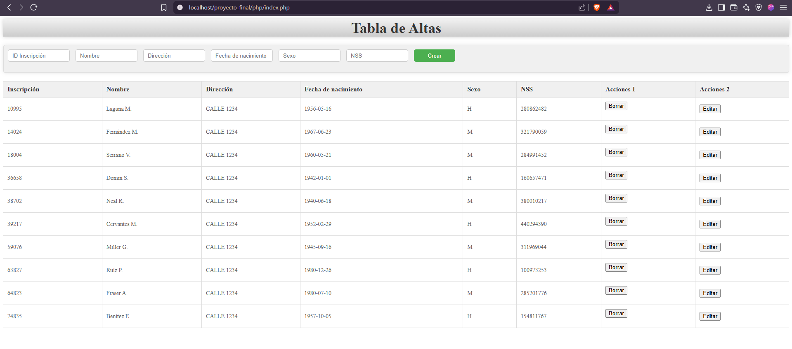
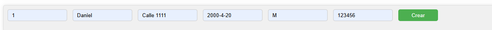
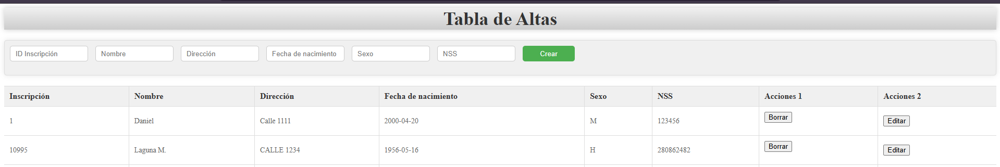
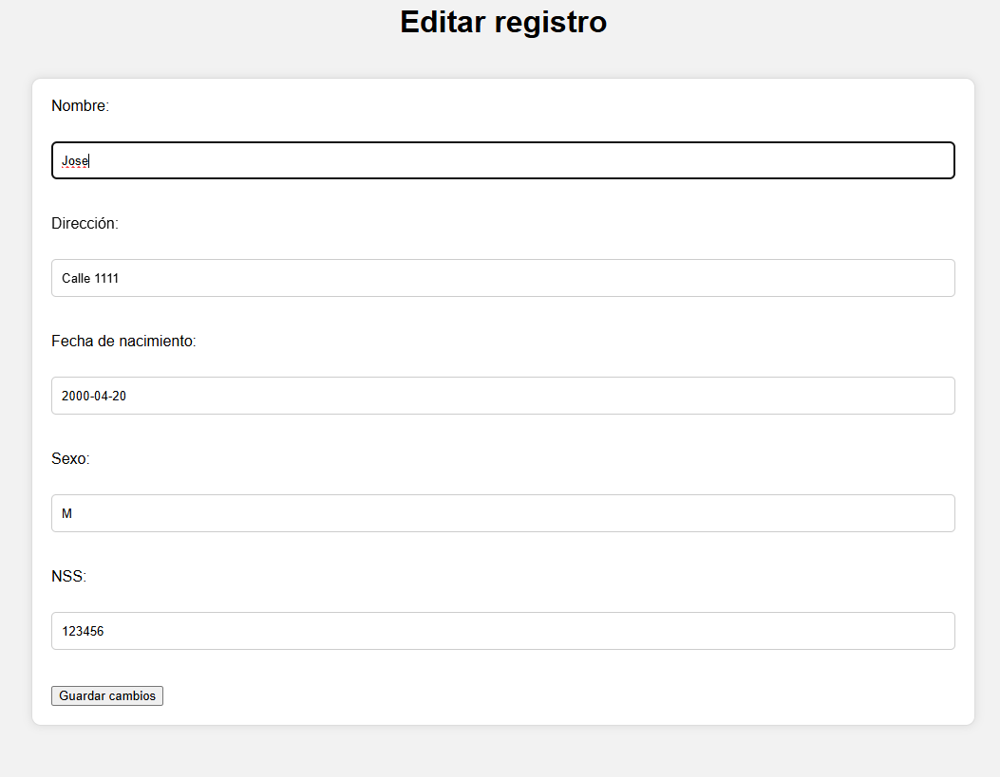
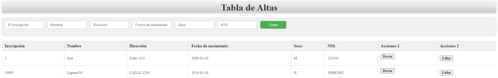

# Proyecto UT6: Creación de página que permita Insertar, leer, modificar y borrar registros. CRUD
     
# Herramientas utilizadas

     - Visual Studio Code
     - Documentación de PHP
     - IA

    
# Requisitos para su uso

    - Navegador que soporte PHP
    - Servidor Apache
    - MySQL

## Estructura de carpetas

### CSS
 - estilo1.css (guarda los estilos de la tabla inicial)

 - estilo2.css (guarda los estilos de la ventana de edición)

### PHP

 - index.html (pantalla inicial en la que se muestra la información de la base de datos, también contiene los campos de texto para la inserción de nuevos registros)

 - Conexión.php (contiene los parametros para hacer la conexion a la base de datos)
 
 - InsertarTabla.php (contiene la lógica que aplicamos sobre los campos de texto para insertar nuevos registros en la base de datos)

 - EditarTabla.php (nueva ventana en la cual se nos presentan los datos del registro que queremos editar. Nos permite cambiar los datos al momento y guardarlos )

 - BorrarTabla.php (lógica del boton de "Borrar", el cual elimina el registro de la tabla y base de datos)

## Ejemplo de uso

Para empezar vamos a abrir la pantalla principal, en mi caso la dirección que usaremos es
http://localhost/proyecto_final/php/index.php
Veremos una tabla en la que se visualizan los registros de las altas del hospital y encima de la tabla unos campos de texto

Ahora introduzcamos un nuevo registro. Con los siguientes datos:

Al pulsar en el boton de crear, el registro se sumará a la base de datos y por consiguiente a la tabla. Los registros se ordenan según el numero de Inscripción que introducimos por lo que este aparecerá como el primero

Supongamos que el nombre es erroneo. Para ello pulsaremos el boton de editar. Esto nos llevará a una nueva ventana en la cual se nos presentan los datos actuales en unos campos de texto que podremos modificar. Cambiemos el nombre a "Jose".

Tras darle al boton de "Guardar cambios" volveremos a la tabla, donde podremos ver los cambios realizados

Ahora borremos ese registro, simplemente presionaremos el boton de borrar. Esto eliminará el registro y actualizará la tabla.

## Autor

Daniel Ramos Montoya

